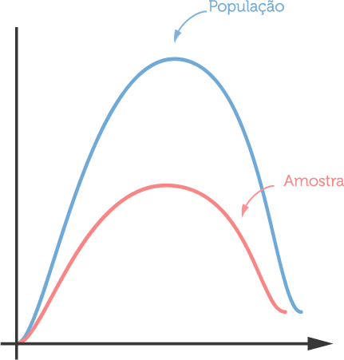

Olá, pessoal,
Vamos continuar. Na aula passada, nós discutimos então sobre amostras. Eu tinha minha população, eu não consigo chegar nela inteira, preciso fazer meu estudo na minha amostra. E aí eu mostrei pra vocês como se calcula média na amostra, como se calcula variância na amostra etc. Só que a gente tem um problema. Nós tínhamos aquele gráfico que era mais ou menos assim: um histograma, e a população era alguma coisa parecida com isso . Era uma curva normal, parecida com uma normal. E a amostra, nós acreditamos que é alguma coisa muito parecida só que com menos dados nesse histograma, então é alguma coisa assim :

Imagine que você descobriu que a média dessa população é 7. Corrigindo: a média da amostra é 7. E aí eu falei pra vocês que nós acreditamos que a média da amostra é a média da população. Mas, imagine que você teve acesso à amostra, calculou que foi 7 e aí você, por algum motivo, teve acesso à população. E descobriu que a média da população não era 7, era 7,3. Teve uma pequena diferença. O que faz sentido, porque a amostra não é a população inteira, a gente está tentando estimar.Você consegue ver o problema de dizer pra alguém que a média é 7, sendo que você não tem essa certeza absoluta? Você não consegue afirmar, com certeza, que a média é 7. Então, o que a gente faz nesses casos? Nesses casos, para não errar tão feio, a gente prefere dar um intervalo pra essa pessoa. Assim, ao invés de falar pra ele que eu tenho certeza que a média dessa população é 7, eu prefiro falar o seguinte. A média dessa população está entre 6 e 8 e eu tenho por volta de 95% de certeza de que isso é verdade.

Veja que é muito melhor eu acertar a expectativa com o meu usuário, com o que eu estou fazendo. É nisso que eu quero chegar, não adianta eu falar um número fixo. Porque você não vai acertar. A gente sabe que, na prática, raramente a média da amostra é idêntica à média da população. Por isso, a gente usa o que chamamos de intervalo de confiança. No exemplo, o meu intervalo de confiança é de 6 a 8. E esse 95% que eu coloquei pra vocês é o que nós chamamos de nível de confiança. Obviamente, um está relacionado ao outro, porque dependendo do nível de confiança que eu quero, eu vou ter um intervalo maior ou menor.

Só que pensar no nível de confiança é complicado. Porque, veja só, se eu dissesse pra você que preciso saber a média dessa população com 100% de certeza. Ou, vamos generalizar mais fácil ainda: preciso que você me fale a média das alturas dos brasileiros com 100% de certeza, você não pode errar, sua vida depende disso. Se você pedisse isso pra mim, eu responderia que o intervalo de confiança da altura do brasileiro varia entre 90 cm e 2,20m. Com 100% de certeza. Percebe? Se eu coloco o nível de confiança muito alto, o que acontece com o meu intervalo? Ele abre. A única maneira de ter 100% de certeza é tendo um intervalo muito grande. Só que adiantou o que essa resposta? Se eu falar pra você que a altura do brasileiro varia de 30cm a 2,5m? Não te contei nada novo.

E aí, tem o lado contrário. Se eu quiser falar pra você que a altura do brasileiro, a média é entre 1,70m e 1,71m, vou ter que dizer que eu tenho 10% de confiança, porque é difícil falar um número desses. Então, você tem que balancear o seu nível de confiança. Geralmente, via de regra, a gente usa 95%. Esse é um número que é bastante aceito por diversas comunidades. Por exemplo, a comunidade de computação usa o muito o número 95%. Já a medicina, que é uma coisa mais delicada, não pode errar... Imagine que estejam fazendo um estudo com remédio, não pode errar. O nível de confiança geralmente é 99%.

Como calcular o intervalo de confiança dada uma distribuição? Aqui, eu não vou entrar na matemática da coisa, porque isso começa a ficar bastante complicado. Eu vou mostrar a teoria em alto nível e depois a gente aplica usando o computador. É alguma coisa mais ou menos assim. Eu vou desenhar de novo a nossa normal aqui. Aqui está a média. E aí, eu tenho os nossos desvios padrões. Nós sabemos que uma distribuição tem, geralmente, três desvios padrões, tanto pra direita quanto pra esquerda.

O que essa galera da estatística faz pra calcular esses intervalos de confiança? Eles conseguem olhar essa curva normal como um cálculo de probabilidade. Como assim? Imagine que isso (eixo horizontal) é a altura da população brasileira. O cara que está aqui nesse extremo é alguém extremamente alto, que tem, por exemplo, 2,30m de altura. Então ele está bem no extremo. A gente olha pra essa curva e tenta descobrir qual é a probabilidade de eu ter um número aqui (onde está marcado 2,30m). Eu consigo fazer isso porque eu sei a frequência de cada uma das alturas das pessoas, então eu consigo tentar calcular a probabilidade desse cara estar aqui (com 2,30m).

Quando eu digo que o meu nível de confiança é de 95%, eu estou dizendo que há 95% de chances de eu ter um número nesse intervalo de 6 a 8. Quando eu falo de 100% de nível de confiança, eu estou dizendo que a chance do número estar dentro dessa curva é 100%, estou olhando pra tudo. Então, se você pega 100% de confiança, geralmente você começa na altura que é 30cm (extrema esquerda do gráfico) e acaba no 2,30m (extrema direita). O 95% de confiança é mais ou menos boa parte do nosso gráfico. Até porque, a gente sabe que, três desvios padrões para a esquerda e três para a direita, você tem a média.Três desvios padrões pra cada lado dá por volta de 99,7% da distribuição. Quando a gente fala 95, consideram-se por volta de 2,5 desvios padrões mais ou menos pra cada lado da distribuição. Eu não vou entrar na matemática doida da coisa, porque isso faz todo sentido pra quem é estatístico, pra quem está cursando uma graduação de estatística. Pra nós que somos pessoas que aplicam estatística no dia-a-dia, importa é entender o que é um intervalo de confiança.

E, retomando, o que é um intervalo de confiança? Eu tenho um nível, o meu nível de confiança é de 95%, e eu quero ter a certeza, eu tenho a certeza, de que a minha média está entre esse intervalo (de 6 a 8). E essa é a confiança. Como que eu calculo isso, pra gente agora não importa, mas é basicamente probabilidade. Então, é assim que nós fazemos quando queremos ser claros na hora de explicar a média de uma mostra e tentar generalizar pra população: damos um intervalo de confiança.

Por essa aula é isso, pessoal. Obrigado!
