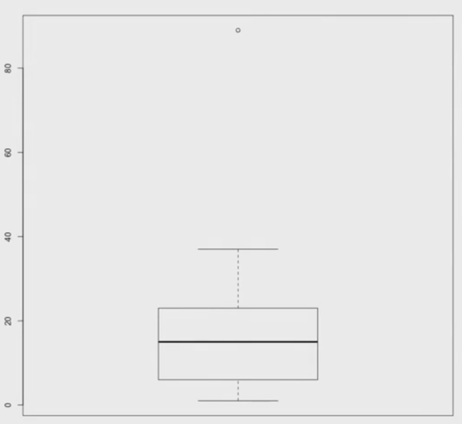

Olá! Agora que você aprendeu porque quartis são legais e o que é um boxplot, vamos fazer isso no R.
E você vai ver que o R está mais que pronto para isso, então a gente não vai ter trabalho nenhum.

Vou criar uma lista qualquer de números, inventando quaisquer números, por exemplo:
```
> numeros <- c (1, 3, 5, 6, 10, 19, 23, 5, 7, 89, 15, 14, 22, 23, 32, 23, 37)
```

E se eu quiser ver o primeiro quartil, o terceiro quartil eu já mostrei o summary, só que agora vocês entendem que esse first quartile e esse third quartile que aparecem aí.
```
> summary (numeros)
```

Então o primeiro quartil é 6; o terceiro quartil é 23. E se você quiser ver o boxplot, digite boxplot e a lista e ele automaticamente desenha para mim o boxplot. Simples assim e sem nenhum segredo.
```
> boxplot (numeros)
```

Óbvio que você pode customizar esse gráfico. Como você vai descobrir isso? Olhando o manual do boxplot.
```
> ?boxplot
```

Dando espaço, o texto desce, e aí você vai ler e entender como ele funciona.

Só que muito rápido, porque o R faz tudo para a gente.

Vou aproveitar e mostrar um truque que eu uso bastante. É o seguinte: eu gerei o gráfico aqui e desenhei o boxplot mas eu não quero ele aqui; eu quero em um arquivo para eu colocar isso em um documento meu, eventualmente em um paper que eu estou escrevendo, então eu quero salvar isso em uma imagem. Como eu faço? Fácil! Eu vou usar a função que se chama png.

png recebe um atributo, um parâmetro: file. E eu vou abrir aspas e aqui eu vou passar para ele o caminho de onde eu vou salvar.
```
> png(file=" "
```

Eu vou abrir uma outra aba e vou descobrir em que diretório eu estou. Eu estou em User/alura/.
```
> png(file="user/boxplot.png"
```

E eu posso passar para ele até o tamanho da imagem: width de 700 pixels e o height de 700.
```
> png(file="user/boxplot.png", width=700, height=700)"
```

Eu coloquei uma aspas sobrando e ele não gostou. Errei. Matei o comando com o comand c [dúvida aqui 02'24], voltou e eu vou apagar essa aspas.

Como que eu fiz ele escrever automaticamente para mim? Seta para cima. Dê uma olhada: a seta no R vai me mostrando os últimos comandos que eu rodei.

Então, de novo: uso o png, com file eu passo o diretório, width eu passo o caminho, height eu passo a altura, sem essa aspas que estava sobrando na linha de cima e dou um enter.
```
> png(file="user/boxplot.png", width=700, height=700)
```

Ele entendeu. Ele sabe o que ele tem que escrever nesse arquivo.

Agora eu vou fazer o boxplot.
```
> boxplot(numeros)
```

Dá uma olhada, ele não fez nada. Por quê? Porque, agora, ele não tem que plotar na tela para mim, ele tem que plotar no arquivo.

Legal! Já fiz tudo o que eu queria nesse arquivo. Preciso falar para ele que acabei, pode salvar. Eu faço isso com:
```
> dev.off()
```

Ele me desce aí 1, que é sucesso. E se eu vier aqui listar, dá uma olhada que eu tenho o boxplot.png. Se eu abri-lo:
```
bash: - userS open boxplot.png
```

Ele vai abrir para mim a imagem:


E, dá uma olhada, a imagem está salva no arquivo.

Por que ele não salvou de primeira aqui, quando eu fiz > boxplot(numeros)? Ele esperou, porque quando eu estou desenhando uma imagem no R, eu posso ir passando comandos na linha de baixo, que acrescentam coisas à imagem. Eu poderia mudar a cor da imagem ou de um traço qualquer ali posteriormente. O R me permite fazer. Então, eu vou manipulando essa imagem e quando eu estou satisfeito, eu faço > dev.off(), dou um enter, e ele salvou a imagem para mim.

Veja só que simples.

De novo, a aula com R é sempre bem rápida, porque você já conhece a teoria e a aplicação aqui é natural.

Então, eu mostrei para vocês como desenhar um boxplot, usando a função boxplot, e mostrei também como salvar em um arquivo.

Até a próxima aula!
