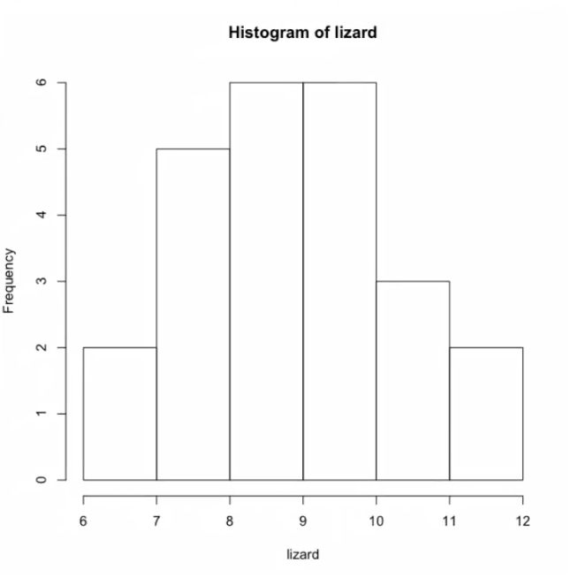
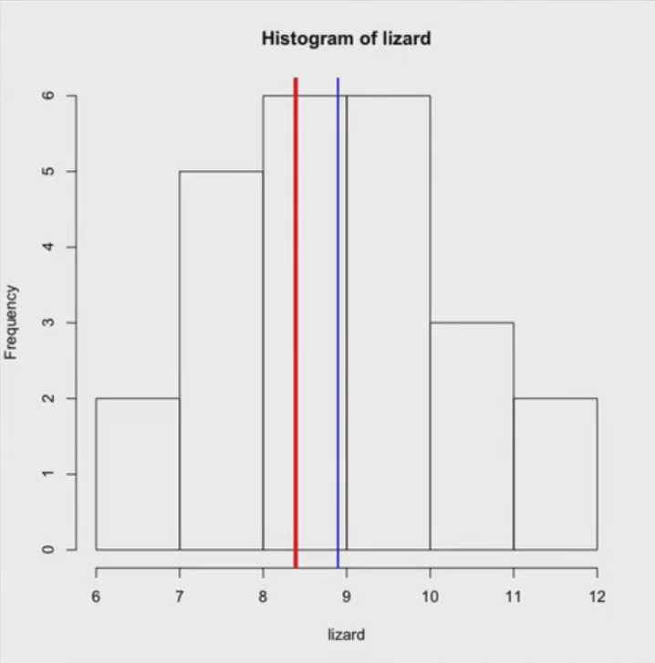
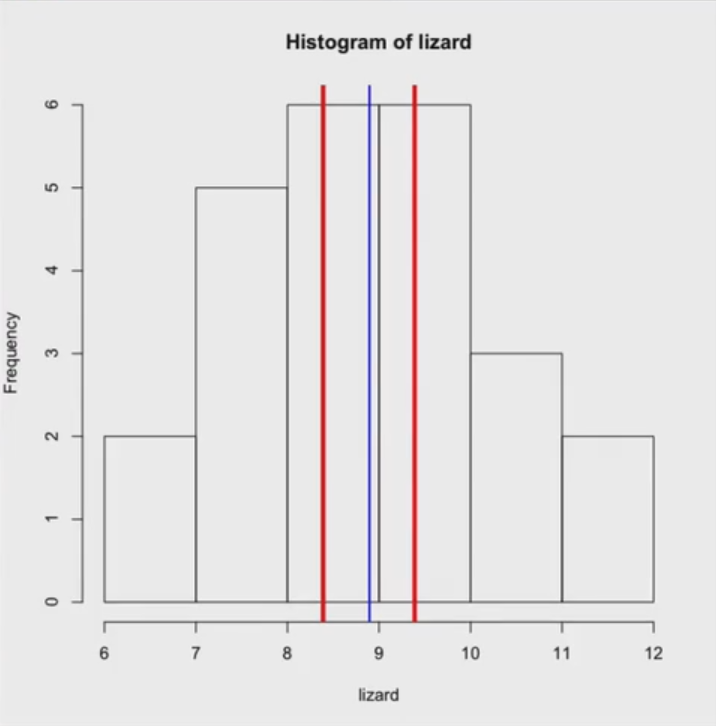

Olá!
Então, na lousa, eu discuti com vocês intervalos de confiança. Aqui, eu tenho essa variável lizard, com um monte de números:
```
> lizard = c(6.2,6.6,7.1,7.4,7.6,7.9,8,8.3,8.4,8.5,8.6,8.8,8.8,9.1,9.2,9.4,9.7,9.9,10.2,10,11.3,11.9)
```
E eu quero calcular o intervalo de confiança nessa distribuição. O R não me dá uma função padrão pra isso. Então, a gambiarra que nós fazemos é usar um teste de hipótese que tem isso como saída. Aqui eu vou usar o t.test, o teste do estudante, que eu vou discutir melhor mais pra frente com vocês. Se eu fizer aqui o t.test e passar o lizard, veja que ele me dá com 95% de confiança que o intervalo está entre 8.29 e 9.49. Então esse é o intervalo de confiança que eu quero.
```
> t.test(lizard)

    One Sample t-test
data: lizard
t = 30.4769, df = 23, p-value < 2.2e-16
alternative hypothesis: true mean is not equal to 0
95 percent confidence interval
 8.292017 9.499649
sample estimates
mean of x
 8.895833
```

E eu posso até mudar o nível de confiança, não precisa ser 95%, pode ser 90. Então, por exemplo, conf. level, como um parâmetro da função t.test, 09. E aqui ele me dá um intervalo ainda mais restrito. Ficou 8.39 até 9.39, muito mais restrito.
```
> t.test (lizard, conf.level=0.9)

    One Sample t-test
data: lizard
t = 30.4769, df = 23, p-value < 2.2e-16
alternative hypothesis: true mean is not equal to 0
90 percent confidence interval
 8.395575 9.396092
sample estimates
mean of x
 8.95833
```

É assim que eu calculo intervalos de confiança usando t.test e ignorando o resto. O t.test eu vou mostrar pra vocês na próxima aula, mas aqui, por enquanto, eu vou usar só essa saída dele. E, com esses números, pessoal, dá pra fazer coisas mais legais. Por exemplo, vou calcular a média dessa distribuição e vou desenhar um histograma:
```
> media <- mean (lizard)
> hist (lizard)
```



Ele me deu um histograma. Só que agora eu quero desenhar coisas nele. Vou fazer assim: abline, plota a média pra mim, v de valor, cor azul, e a grossura da linha 2.
```
> media <- mean (lizard)
> hist (lizard)
> abline(v=media, col="blue", lwd=2)
```

Olha só, apareceu uma linha bem na média. Dá pra melhorar isso, dá pra, por exemplo, colocar uma linha no primeiro limite lá do meu intervalo de confiança, 8.39. Eu vou pintar essa linha de vermelho e vou colocá-la bem grossa:
```
> media <- mean (lizard)
> hist(lizard)
> abline(v=media, col="blue", lwd=2)
> abline(v=8.39, col="red", lwd=4)
```


Um intervalo está aqui e outro está no 9.39:
```
> media <- mean (lizard)
> hist(lizard)
> abline(v=media, col="blue", lwd=2)
> abline(v=8.39, col="red", lwd=4)
> abline(v=9.39, col="red", lwd=4)
```


Lembra que eu falei naquela aula que quando plotava e salvava imagens em arquivo, que eu podia chamar funções embaixo de funções? Então, eu chamei o hist e ele desenhou um histograma, aí o abline ficou me desenhando linhas. Então, olha só que legal. Olha aonde está a média, que eu sei, e dá uma olhada no intervalo de confiança. Esse é pra 90%, se eu tivesse pedido pra ele calcular o intervalo de confiança como 70%, ficaria muito mais apertado, veja, 8,58 - 9,20:
```
> t.test(lizard, conf.level=0,7)

    One Sample t-test
data: lizard
t = 30.4769, df = 23, p-value < 2.2e-16
alternative hypothesis: true mean is not equal to 0
70 percent confidence interval
 8.586334 9.205333
sample estimates
mean of x
 8.895833
```

Mas é uma confiança de 70%, será que eu quero, será que eu não quero? Já discutimos sobre isso. É assim que nós calculamos, usando aí a gambiarrazinha de usar o teste do estudante que dá pra gente como saída um intervalo de confiança.

Obrigado!
