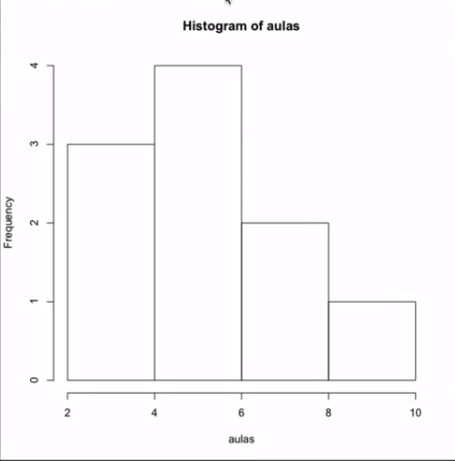

Na aula passada nós começamos nosso curso de Estatística com os tipos de dados. Agora vamos começar a colocar isso em prática. Esta aula servirá basicamente para introduzir a ferramenta R. R é uma linguagem de programação muito utilizada por estatísticos, então é uma linguagem em que você tem um monte de comandos com tudo que precisamos de estatística já pronto. Muitas pessoas gostam de utilizar o Microsoft Excel, que é uma boa ferramenta, mas aqui vamos falar de coisas mais avançadas, onde o suporte do Excel deixa a desejar. R é a ferramenta que com certeza é usada por pessoas de Estatísticas.

### Instalação

É uma instalação padrão como a de qualquer software que você faz em sua máquina. Ele é gratuito, basta baixar da internet. Então, por exemplo, para o sistema operacional Mac [ou Windows], buscamos no Google "R para MacOS". A pesquisa retorna a página do R para o MacOS. Baixe a versão certa para o seu sistema e faça a instalação. Após seguir os passos de instalação, você está pronto para utilizá-lo.

Nas nossas aulas utilizaremos direto a linha de comando, pois ela é independente do sistema operacional. Se preferir, você pode baixar a versão com a interface gráfica.

Ao digitarmos “R” logo na primeira linha:
```
bash:~ home$ R
```

O programa retorna diversas informações relacionadas ao R, como a versão instalada e algumas dicas:

```
R version 3.1.2 (2014-10-31) -- "Pumpkin Helmet"
Copyright (C) 2014 The R Foundation for Statistical Computing
Platform: x86_64-w64-mingw32/x64 (64-bit)

R é um software livre e vem sem GARANTIA ALGUMA.
Você pode redistribuí-lo sob certas circunstâncias.
Digite 'license()' ou 'licence()' para detalhes de distribuição.

R é um projeto colaborativo com muitos contribuidores.
Digite 'contributors()' para obter mais informações e
'citation()' para saber como citar o R ou pacotes do R em publicações.

Digite 'demo()' para demonstrações, 'help()' para o sistema on-line de ajuda,
ou 'help.start()' para abrir o sistema de ajuda em HTML no seu navegador.
Digite 'q()' para sair do R.
```

O R interpreta tudo que escrevermos: se digitarmos “1”, retornará “1”, se digitarmos “1+1”, retornará “2”. Ou seja, qualquer expressão matemática retornará seu resultado:

```
>  1

[1] 1

> 1+1

[1] 2

> 3*8+2/5

[1] 24.4

> (3*7)/4

[1] 5.25
```

Podemos também utilizar parênteses para definir precedência de operações e outros operadores que já estamos acostumados.

### Variáveis

Podemos querer guardar resultados de operações para utilizarmos depois. Para tal, utilizamos o símbolo “<-”, que tem formato de seta, após o nome que queremos dar à essa variável (por exemplo “numero”):
```
> numero <- (3*7)/4
```

Depois disso, toda vez que digitar “numero” e der ENTER, o programa retornará o resultado da conta atribuída a essa variável:
```
> numero
[1] 5.25
```

Podemos fazer contas com ela:
```
> numero * 2
[1] 10.5
```

### Listas

Um outro comando muito importante para se guardar informações é o método “c( )”, que guardará uma lista de números. Funciona da mesma forma como guardamos uma variável:
```
> lista <- c(1, 2, 3, 4, 5, 6)
```

Se digitarmos “lista”:
```
> lista
[1] 1 2 3 4 5 6
```

Igualmente, podemos fazer operações com uma lista:
```
> lista * 2
[1] 2 4 6 8 10 12
```

### Conjunto de Dados e Histograma

Agora vamos utilizar o método de criar listas para montarmos histogramas. Vamos usar o exemplo da aula passada, onde tínhamos os dados de quantas aulas cada aluno assistiu na escola:
```
> aulas <- c(2, 4, 4, 6, 6, 6, 6, 8, 8, 10)
```

Com esta lista de dados guardada podemos plotar um histograma de forma muito simples:
```
> hist(aulas)
```

No mesmo instante abrirá uma janela com o histograma desenhado:


Temos a opção de customizar esse histograma por meio de comandos que encontramos digitando “?hist”. Para voltar às linhas de comando basta digitar “q”.

Como você deve ter percebido, o R vem com seu próprio manual. Dê uma lida nele para ir se acostumando com os comandos, uma vez que todas essas funções dão suporte a muita coisa. Outra opção é procurar na internet esse manual ou partes dele. Tente digitar “hist R” no Google.

### Revendo

Nesta aula aprendemos: Como instalar o R. Como fazer uma operação básica em R Como usar uma variável com um nome qualquer utilizando “<-" Listas utilizando o método “c( )” * Como criar um histograma utilizando o comando “hist( )”

Até a próxima aula!

