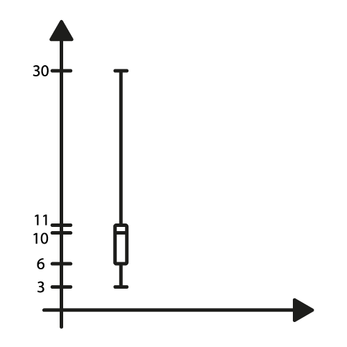

Olá! Na aula passada, nós discutimos sobre média, mediana e moda. Agora, vamos usar essas ideias para o nosso dia a dia. Aqui, eu tenho um cenário.
Imagine que eu trabalhe em uma fábrica e essa fábrica tem pessoas que consertam aparelhos. Eu tenho o JOÃO e o JOSÉ, que são dois candidatos a uma vaga que eu tenha aberto em minha empresa. Eu tenho um número sobre essas pessoas:

João

| Frequência | Aparelhos Consertados |
|------------|-----------------------|
| 1          | 7                     |
| 1          | 8                     |
| 1          | 9                     |
| 2          | 10                    |
| 2          | 11                    |
| 1          | 12                    |
| 1          | 13                    |

José

| Frequência | Aparelhos Consertados |
|------------|-----------------------|
| 2          | 3                     |
| 1          | 6                     |
| 2          | 7                     |
| 3          | 10                    |
| 1          | 11                    |
| 1          | 13                    |
| 1          | 30                    |

O João em um dia consertou sete aparelhos; em um outro dia, ele consertou oito; em dois dias ele consertou dez; em dois dias ele consertou 11 e assim por diante. Então, eu tenho a quantidade de aparelhos que ele conserta por dia e a quantidade de vezes em que isso aconteceu.

E a mesma coisa para o José: eu tive dois dias em que o José conseguiu consertar três aparelhos; eu tive três dias em que o José consertou dez aparelhos; eu tive um dia em que o José consertou 30, ele estava super produtivo.

Agora, a pergunta é... Eu tenho João e José e uma vaga só aberta, quem eu contrato? Qual dos dois eu escolho?

Já que na aula passada, em que vocês aprenderam média, mediana e moda, a gente poderia tentar usar isso. Por exemplo, a gente poderia tentar descobrir a média de consertos do João por dia, a média de consertos do José por dia, e ver qual dos dois tem a média maior, porque eu quero contratar o cara que conserta mais aparelhos.

Só que nos números que eu dei para vocês, se você calcular tanto a média, quanto a moda, quanto a mediana dessas duas distribuições, você vai ver que o valor é 10. Exatamente 10. Ou seja, para média, mediana e moda, esses caras são idênticos!

**Qual dos dois eu contrato?**

Eu estou falando isso porque a média é uma ótima maneira de te dar a tendência central daquela distribuição, mas ela não te explica muita coisa sobre como esses dados estão dispersos. Porque eu quero saber que o cara conserta 7 aparelhos e mais ou menos três por dia. Essa é a média dele. Esse mais ou menos três, essa informação não está nem na média, nem na mediana, nem na moda. A gente tem que achar uma maneira de tentar descobrir o quanto a nossa distribuição está espalhada para complementar a informação da média.

Vamos começar da maneira mais simples, que é a seguinte: Eu poderia, por exemplo, pegar o maior valor que apareceu para mim e subtrair do menor valor. Eu vou chamar isso de amplitude.

A amplitude do João é 13-7=6.

Já a do José é 30-3=27.

O 6 e o 27 me dão uma noção do quanto esses dados estão espalhados.

Nesse exemplo, o José está bastante espalhado - porque eu tenho números grandes e números pequenos - então, a amplitude é muito grande. Já o João tem uma consistência melhor, ele sempre faz mais ou menos a mesma quantidade por dia, por isso o valor dele é 6.

Só que essa maneira de calcular, simples assim como mostrei, o maior elemento da minha distribuição (limite superior) menos o menor elemento de minha distribuição (limite inferior) é uma maneira muito simples porque ela é fácil de ser enganada.

É só olhar, por exemplo, para o José. Ele conserta 3, 6, 7, 10, 11, 13 e, de repente, 30. Ele teve um dia excepcional no trabalho dele que fez com que ele consertasse 30 aparelhos. Mas aconteceu uma vez, foi uma exceção, não acontece sempre. Justamente porque esse 30 está aqui, ele afetou o valor da amplitude.

Está aí uma outra coisa para você se preocupar no seu dia a dia: sempre que você olha uma distribuição, você tem que se preocupar com esses dados que estão muito fora da distribuição, muito fora da curva. Em inglês, nós chamamos isso de outlier, o cara que está muito fora do resto dos dados. E o outlier - eu comentei com vocês na aula da média - ele atrapalha o cálculo. (Lembrem do exemplo do salário. O cara ganha R$2.000; outro ganha R$2.000; outro ganha R$50.000. Esse R$50.000 atrapalha.) Esse outlier de 30 atrapalha o nosso cálculo da amplitude. Essa é uma maneira ruim, portanto, de calcular a dispersão dos nossos dados.

Vamos lá. Antes de chegarmos a uma maneira interessante de calcular essa dispersão a primeira coisa que eu quero discutir com vocês é como filtrar esses outliers. Como jogar esse 30 fora? Como jogar esse 3 fora? Porque esse 3 também é um outlier. Você percebe que 6, 7, 10 se repetem muito mais do que 3. No José é mais difícil dizer, mas o 7 também pode ser um outlier. Um outlier pode ser um cara muito grande ou um cara muito pequeno. Então, eu preciso de uma maneira "procedimental", eu preciso de um jeito mecânico de jogar fora esses outliers.

Como fazemos isso? A gente usa a distribuição por quartis. Eu vou dividir minha distribuição em 4 pedaços.

Por exemplo, o José. Eu tenho aqui a tabela de frequência e eu vou escrever todos os números dessa tabela:
```
3 3 6 7 7 10 10 10 11 13 30
```

Então, essa é a distribuição do José. Eu quero dividir ela em 4 pedaços. Então, vamos contar quantos elementos eu tenho: 11 elementos.

Vamos lá, eu quero dividir isso em 4, mas não em 4 partes "exatamente iguais". Eu quero pôr 25% para esquerda, 25% para direita e 50% no meio. Porque se eu tiver 25% para esquerda, 25% para direita, e o que está no meio; perceba que eu joguei os outliers fora, porque os outliers ou são números muito pequenos ou são números muito grandes. E aí a gente acredita que esses números muito pequenos vão morrer nesses 25% primeiros e os números muito grandes vão morrer nos 25% do fim. E eu vou usar somente os 50% do meio da minha distribuição, e ali eu tenho mais ou menos a certeza de que eu não vou ter outlier. Isso é o que chamamos de distribuição por quartis.

Agora, vamos calcular os lugares exatos. Primeira coisa, eu conto o número de elementos. Eu tenho 11 elementos aqui e eu preciso achar a posição do primeiro quartil. E para descobrir isso é fácil. Eu pego o total de elementos da minha distribuição, que são 11 e divido por 4, que são os números de quartis. Isso aqui me dá 2,75, que arredondado para cima dá 3. Você achou a posição do primeiro quartil.
```
3 3 (6) 7 7 10 10 10 11 13 30
```

Agora, nós precisamos achar o que chamamos de terceiro quartil. Como que eu faço isso? 3n/4, porque eu quero que 3/4 dos meus dados estejam antes desse terceiro quartil. Então 33/4=8,25, que eu vou arredondar para 9.
```
3 3 6 7 7 10 10 10 (11) 13 30
```

E o que está no meio é o que a gente acaba usando nas nossas contas por que 7, 10, 10, 10 não tem outlier e isso representa melhor a nossa distribuição.

Isso é o que chamamos de distibuição por quartis. A vantagem disso é conseguir eliminar os nossos outliers. Então pense nisso sempre que você tiver uma distribuição que tenha esses dados fora da curva. E esse tipo de informação é tão comum que a gente já tem um gráfico que é muito usado no dia a dia, que é o gráfico que nós chamamos de boxplot. Vou mostrar para vocês como ele funciona.

A ideia do boxplot é passar para a gente todas essas informações: o primeiro quartil, o terceiro quartil, a média... em um único desenho.

Vamos desenhar esse boxplot e vamos desenhar para o José. Eu tenho aqui um gráfico de eixo e, para mim, só importa o eixo y nesse momento. Vou começar colocando o menor valor da minha distribuição que é o 3.

Então eu tenho o 3 aqui e no gráfico eu vou representar por um traço simples. O próximo número que eu vou representar é o número do primeiro quartil que é o número 7. Imagine a posição do 7 no gráfico, onde eu vou ter um traço. E a gente até liga esse traço com o traço do número 3. Você já vai entender o desenho como um todo.

O próximo que eu vou fazer é representar o terceiro quartil que é o 11. Coloco o 11 no gráfico e agora eu vou fechar uma caixa.

Lá em cima eu vou representar o maior valor da minha distribuição que nesse caso é 30 - valor bem fora da curva.

E no meio desse gráfico, eu vou representar também a nossa mediana, que nessa nossa distribuição é o 10.

Então, olhem só o que é o tal do boxplot; em um simples gráfico, você sabe:

* o menor valor da sua distribuição (limite inferior);
* o maior valor da sua distribuição (limite superior);
* o primeiro quartil;
* o terceiro quartil;
* a mediana.



A mesma informação que a gente fez naquele desenho da lista de números, agora está em um gráfico boxplot.

Então, esse gráfico é bastante famoso por causa disso, porque só de bater o olho, você tem ideia de como sua distribuição funciona.

Veja só que a distância no gráfico do número 30 nos dá a noção de que eu tenho outliers. O outlier inferior é pequeno, porque a distância no gráfico é pequena, mas em relação ao limite superior ela é grande, então eu tenho outliers, portanto eu preciso pensar realmente em quartis.

Nesse capítulo, era isso que eu queria mostrar para vocês. Que a média quando eu quero comparar duas distribuições não é suficiente, porque a média me dá a tendência central, mas eu preciso saber também o quanto esses dados variam dentro da distribuição. E assim, começamos a discussão de como chegar nessa variância.

Primeiro, mostrei aquele cálculo simples de amplitude (o limite superior menos o limite inferior), mas a gente discutiu que ela é facilmente influenciada pelos outliers.

Aí chegamos até a distribuição por quartis, cuja ideia é eliminar esses outliers, excluindo 25% dos dados da esquerda e 25% dos dados da direita e usando os 50% que estão no meio da distribuição.

Mostrei como calcular o primeiro quartil e o terceiro quartil:

* para o primeiro quartil, pegue o tamanho da sua distribuição e divida por 4, achando um número que, se der quebrado, deve ser arredondado para cima.
* a mesma coisa para o terceiro quartil, só que aqui eu multiplico por 3n, porque eu quero o terceiro quartil, então 3n/4, se o resultado der quebrado, deve ser arredondado para cima.

Calculei também a mediana.

E, dessa forma, eu consigo desenhar meu boxplot. E só de olhar meu boxplot, eu tenho uma noção de como é a distribuição.

**Fica para vocês como lição de casa desenhar o boxplot do João.**

Veja só, o João tem um caso engraçado. O limite inferior é 7 e qual é o primeiro quartil? A gente vai ter que calcular. Vai ficar de lição de casa para você. Então, coloquem até um boxplot ao lado do outro, e você vai ver que isso vai facilitar a sua comparação.

Nos próximos capítulos eu vou chegar nos finalmentes, em como calcular a variância dessas duas distribuições.

Até a próxima aula!
