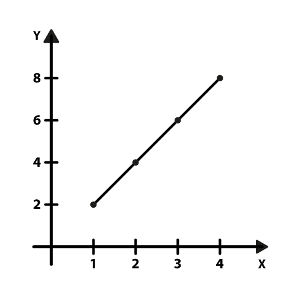
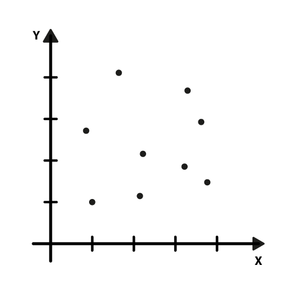

Correlação e Causalidade
Na aula passada estudamos sobre Testes de Hipótese, cuja ideia era verificar se duas amostras são diferentes. Vimos o exemplo do remédio para febre: ao analisar duas amostras verificamos se a diminuição da febre ocorria de verdade ou era por sorte.

Nesta aula vamos comparar duas variáveis, porém de maneira diferente. Veremos a correlação entre elas, ou seja, quando uma muda a outra também muda junto. Por exemplo: quanto mais nuvens no céu maior a área onde a chuva cai. Vejamos um exemplo com duas variáveis quaisquer X e Y:

X | Y
------------ | -------------
1 | 2
2 | 4
3 | 6
4 | 8

Percebe-se uma relação muito forte entre essas duas variáveis. Quando X cresce, Y também cresce na mesma proporção. 
Se traçarmos um gráfico:

Nesse caso temos uma correlação linear, além de ser perfeita, pois não possui sequer um ponto fora da curva. Chamamos essa correlação perfeita de +1.0. Em exemplos reais é quase impossível chegarmos a esse tipo de correlação. Muito provavelmente você encontrará algo parecido com isso:

A questão aqui é qual será a melhor linha reta a ser traçada por esses pontos.

Essa linha nos indica graficamente a correlação entre as variáveis, quanto uma influencia a outra.

Nós estudamos a correlação entre variáveis construindo essa linha e medindo a distância entre ela e os pontos.

Geralmente, funções de correlação nos retornam valores entre -1 e 1. - ]0, 1]: a correlação é positiva, se uma variável cresce, a outra cresce. - [-1, 0[: a correlação é negativa, se uma variável cresce, a outra decresce. - zero: não há correlação alguma entre as variáveis.

Veja o que seria um gráfico no qual a correlação entre duas variáveis é zero ou quase zero:

Da mesma forma que selecionamos qual Teste de Hipótese ou Tendência Central utilizaremos para cada tipo de dado, também devemos observar as amostras para escolher o tipo de Teste de Correlação que melhor se adequa. - Para uma distribuição Normal: Teste de Pearson. - Para uma distribuição não Normal: Teste de Spearman.

ATENÇÃO: Correlação não implica em Causalidade. Ou seja, mesmo havendo uma alta correlação entre duas variáveis, isso não significa que uma causa a outra.
