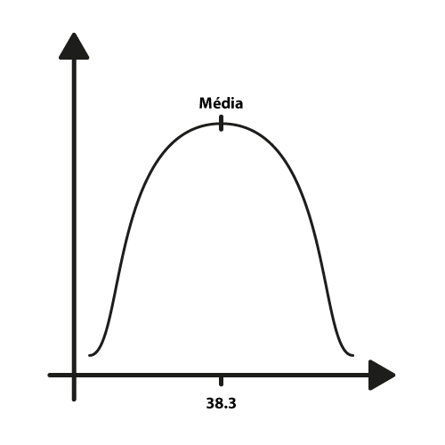
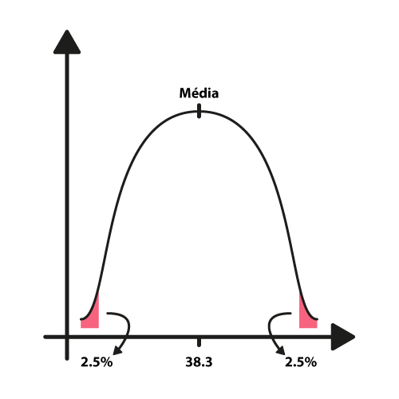
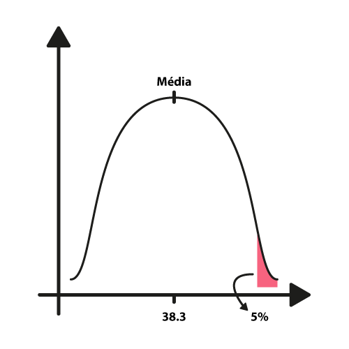

# Provando ou Desprovando: Testes de Hipótese

Vamos continuar nossa discussão da aula passada. Para isso vejo um exemplo:
Um laboratório criou um novo remédio com o propósito de acabar com a febre das pessoas. Queremos descobrir se esse remédio faz efeito nos pacientes ou não. Como fazer isso? Em primeiro lugar, não temos condições de acesso a toda população com febre no planeta, portanto trabalharemos em cima de uma amostra.

Porém, como podemos descobrir, com um certo nível de confiança, se a amostra realmente reflete a população total? Para isso existem os Testes de Hipótese.

Como o próprio nome já diz, devemos nos servir de uma primeira hipótese, que chamamos de H0 (ou Hipótese Nula), que é aquilo que queremos desafiar:

H0: o remédio não abaixa a febre

A H0 supõe que os grupos não mudam após o experimento. O que queremos agora é que ela seja falsa, queremos provar o contrário dela.

Então criamos uma outra hipótese, a Halt (ou Hipótese Alternativa):

Halt: o remédio abaixa a febre

Por que é a Hipótese Alternativa que procuramos? Porque provar que alguma coisa acontece é impossível. Não conseguimos provar que o remédio funciona.

Precisamos mostrar que H0 é falsa. Provando isso, consequentemente Halt é verdadeira.

### Fazendo o Teste
Medimos a febre de uma população de 100 pessoas, e descobrimos que a média da temperatura corporal delas é de 38,3 graus Celsius.

Colocando os dados em uma distribuição, desenhamos o gráfico:

Após medicarmos essas 100 pessoas com o nosso remédio, observamos que sua temperatura corporal média foi para 36,3 graus Celsius.

Apesar da diferença ser grande, será que esses dados são suficientes para nos dizer se o remédio funciona?

A ideia aqui é verificar qual a chance da média ser 36,3. É uma questão de probabilidade. Se a chance for muito baixa, por exemplo de 5%, então ou milagre ocorreu ou descartamos a H0.

Por motivos de cálculo estatístico, nós utilizamos o conceito de Nível de Confiança, logo, nesse caso, ele é de 95%. Se voltarmos para o gráfico, perceba que a chance da temperatura medida estar nos extremos é pequena.

Note que os 5% foi dividido na metade e distribuído nos extremos do gráfico.

Esse é o p-value, é a probabilidade, nesse caso, de medirmos 36,3 na distribuição onde a média era 38,3. E se esse número for pequeno o suficiente, nós descartamos H0 e aceitamos Halt.

Ao rodar um Teste de Hipótese em um programa, fique atento ao p-value. Se ele for menor que 0,05, ou seja 5%, descarte a Hipótese Nula e aceite a Hipótese Alternativa.

Existem vários Teste de Hipóteses para cada tipo de distribuição. Dois deles são os que nos interessa:

* Student t-test: para distribuição Normal
* Wilcoxon: para distribuição não Normal

Agregando com o que aprendemos na aula passada:

* sempre precisamos pensar na amostra com a qual está lidando,
* discutir os resultados dos valores antes e depois da experiência ser realizada,
* e rodar o Teste de Hipótese.
* Ao rodá-lo, verifique o p-value. Ele é pequeno? A hipótese que queríamos provar é verdadeira.

### Two Tailed Test, One-Sided Test

Mas e se:

1. nosso remédio aumentasse a febre?
2. estivermos experimentando o remédio para saber qual seu efeito?

Estamos preocupados aqui com os dois lados: os valores crescerem ou diminuírem. No gráfico que já mostramos os valores estão em ambos os lados da distribuição.

Isso é o que chamamos de Two Tailed Test, ou seja, estamos olhando para os dois extremos.

Preste atenção que depende muito da maneira como você formula seu problema. Se, no exemplo, tivéssemos a certeza de que o remédio só abaixa a febre, poderíamos olhar para apenas um dos extremos.

Esse é um caso de One Sided Test.

A ferramenta de estatística, quando você for rodar o t-test (ou Wilcoxon), ira perguntar se o teste é Two Tailed ou One-sided.

### Um outro exemplo
Em termos práticos, se conseguirmos formular a Halt utilizando o sinal de diferente (?), as coisas ficam mais fáceis de serem visualizadas.

Queremos descobrir se a média de salário das mulheres é diferente da dos homens no Estado de SP.

Ho: os salários são iguais

Halt: os salários são diferentes

"Diferente" significa ser maior ou menor, então olhamos para ambos os lados da distribuição.

No primeiro exemplo, como queríamos saber apenas se o remédio abaixava a febre, olhamos para apenas um dos lados.

### Revendo
Em um Teste de Hipótese:

* verificamos se uma hipótese é verdadeira ou não negando uma hipótese, a Hipótese Nula e assumindo que a outra é verdadeira, a Hipótese Alternativa;
* Escolhemos um teste - dentre vários possíveis;
* E por probabilidade calculamos a chance da mudança acontecer na minha distribuição anterior;
* Se a chance for baixa, ou seja o p-value, eu descarto a H0 e aceito a Halt.
