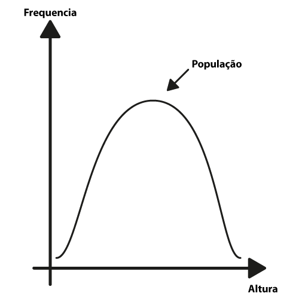
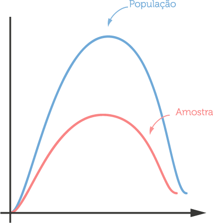

Olá, então agora você aprendeu um monte sobre estatística. Já aprendeu média, mediana, moda, variância, desvio padrão, distribuição por Quartis etc. Está na hora de começar a aplicar isso, né? Porque, no fim das contas, pra quê você quer estatística? Você quer usar estatística pra entender como determinado grupo se comporta.
Então, imagine que você quer fazer, por exemplo, um estudo pra descobrir qual é o time de futebol brasileiro que tem mais torcida, ou qual é o prefeito ou presidente que vai ser mais votado etc. Você vai ter que ir pra rua e falar com essas pessoas. Então, por exemplo, se você quer descobrir para quem a pessoa torce, você vai ter que perguntar:

**Qual é o seu time de futebol favorito?**

E é aí que entra o problema. Porque, veja só, imagine que você quer descobrir qual é o time de futebol mais popular no Brasil inteiro. Pra saber isso com exatidão, você teria que perguntar para os nossos mais de 200 milhões de brasileiros para que time eles torcem. É impossível, certo? Impossível por vários motivos:

1. é impossível conseguir 200 milhões de pessoas
2. mesmo que você conseguisse, talvez isso seja muito caro. Você vai ter que pagar um ser humano ou uma máquina, qualquer coisa do tipo, pra falar com 200 milhões de pessoas.

O primeiro problema que eu quero mostrar pra vocês é que a gente quer entender como uma determinada população se comporta, veja a palavra aqui população, o conjunto total de pessoas que eu quero estudar, mas não tenho acesso a essa população inteira. Como fazer? O grande segredo da estatística é achar a amostra. A amostra é um conjunto de pessoas que eu arranco dessa população - é um conjunto muito menor, obviamente, fica mais barato - e faço meu estudo em cima dessa amostra. E a ideia é que, se eu selecionei bem essa amostra eu vou conseguir generalizar os números que eu encontrei pra minha população.

Então, é assim que fazemos. Se eu quiser descobrir, por exemplo, qual é o time mais popular do Brasil, eu não preciso falar com os 200 milhões de brasileiros. Eu posso eventualmente falar com mil ou dois mil brasileiros e tentar generalizar isso. Só que não é tão fácil assim quanto parece. No primeiro dia de aula, eu comentei aquela frase, que vocês já devem ter ouvido falar:

**Existem mentiras, grandes mentiras e estatísticas**

Uma maneira muito fácil de você errar é justamente escolhendo uma má amostra. Por exemplo, imagine o seguinte: que você quer descobrir de novo o time de futebol preferido do Brasil. Aí você decide que vai entrevistar só a família. E pergunta:

**Mãe,pra que time você torce? Pai, pra que time você torce? Irmão, pra que time você torce?**

Muito provavelmente, todo mundo torce pro mesmo time, e aí você vai descobrir que, no Brasil, todo mundo torce pro time A ou pro time B. Por quê isso aconteceu? Porque eu escolhi a amostra errada. Então, você como pesquisador, como estatístico, tem que escolher a amostra de maneira decente, de maneira correta.

Dicas pra isso: como eu escolho a minha amostra? Idealmente, ela tem que ser randômica. Da seguinte forma: eu tenho a minha população inteira e eu quero pegar pedaços dessa população. Mas, eu não quero pegar pedaços específicos, por exemplo, eu não quero falar com meu irmão, porque o meu irmão está perto de mim. Tem que ser randômico, ou seja, qualquer um que está dentro dessa população tem que ter a mesma chance de ser escolhido nesse meu momento lá de escolher a minha amostra: isso é uma amostra randômica. O que também não é algo tão fácil, dependendo do estudo que você quer fazer.

Imagine que você queira fazer um estudo com os 200 milhões de brasileiros. Pra que isso acontecesse de verdade, idealmente você pegaria a lista telefônica, folhearia, pararia numa folha do meio e escolheria um nome. E aí você escolheu alguém de maneira randômica. Mesmo assim, talvez você ainda tenha um viés, porque talvez haja uma pessoa que mora numa região muito pobre, que não tenha telefone, e cujo nome não esteja na lista. Mas, é uma maneira.

Agora, vamos imaginar um cenário menor. Você quer fazer um estudo na sua escola. Você quer descobrir como os alunos da sua escola se comportam. Então, você tem lá, 500 alunos e você tem que escolher de maneira aleatória um desses 500 alunos. É assim que funciona e é o que nós chamamos de amostra randômica.E, mesmo assim, isso é complicado. Imagine que você quer descobrir como os alunos da sua escola funcionam. E você quer descobrir qual é o melhor professor da sua escola. Se você tem aulas nos turnos da manhã, tarde e noite, só pegar alunos da manhã pode ser complicado. Ou pegar só alunos da tarde, ou só alunos da noite. Porque esse grupo de pessoas pode ter opiniões diferentes, então você tem que tomar cuidado com todas essas possibilidades.

Uma outra maneira conhecida pra você conseguir a sua amostra é fazer o que nós chamamos de amostra estratificada. Como assim? Por exemplo, se eu sei que existem grupos. Na minha escola, eu tenho as turmas da manhã, as turmas da tarde e as turmas da noite. Aí eu separo manhã, tarde e noite, e dentro desses grupos eu randomizo e pego alguns alunos, pra garantir que eu vou ter sempre alguns alunos de cada turno. Generalizando de novo, imagine que você queira descobrir times de futebol do Brasil, só que você só entrevista pessoas do sudeste pra baixo. Aí, obviamente, vai dar São Paulo, Corinthians, Grêmio, Internacional... Mas, ninguém vai falar que torce pro Sport, por exemplo, porque você não pegou pessoas do nordeste. Então, se eu fosse fazer uma amostra estratificada no país, eu pegaria um pouquinho de pessoas do sul, um pouquinho do sudeste, um pouquinho do norte, nordeste, centro-oeste. Isso é o que nós chamamos de amostra estratificada.

De novo: existem técnicas diferentes pra você buscar por conjuntos de pessoas. Então, eu já falei pra você que você tem que selecionar com carinho na hora de selecionar sua amostra. Agora, vamos entender no nosso desenho, no nosso gráfico, como isso ficaria. Imagine que aqui eu tenha um histograma, lembra do histograma? Ele conta pra mim, mais ou menos, a frequência pela variável que eu estou medindo, como, por exemplo, a altura da população. Então, aqui eu tenho, nesse eixo (horizontal) a altura, nesse eixo (vertical) a frequência. Quantas pessoas têm 1,50m? Quantas têm 1,60m, 1,70m etc? E a gente sabe que, se a nossa distribuição for normal, a nossa curva é mais ou menos assim, certo?


Imagine que isso (a curva) é a minha população. Quando eu seleciono a minha amostra menorzinha, pronta pra ser estudada, estou imaginando que o histograma dela é mais ou menos assim:


Parecido com o da população. Imagine que é uma normal também, só que tem menos dados. É essa a diferença da população pra amostra, certo? Eu tenho simplesmente menos dados.

Sabendo disso, eu quero agora, então, calcular as coisas para a amostra que é a que contém os meus números e generalizar pra população. Média, como a gente faz? A média, dado que as distribuições são normais, nós acreditamos que a média da amostra é igual à média da população. Simples assim, sem segredo. Mas, agora, a pergunta é a variância. Lembra o que é a variância? É mais ou menos quando os números estão espalhados no gráfico. Nesse caso, como nós sabemos que a população é muito maior e provavelmente tem aqueles outliners etc, nós temos uma fórmula um pouquinho diferente de calcular a variância.

Vamos lá. Você lembra que, para calcular a variância, eu fazia a diferença de cada número para a média e dividia pelo número de elementos? Vai continuar a mesma coisa. Então, eu vou dar o mesmo exemplo da aula passada. Deixa eu ver os números:

* 1, 2 e 9
* Média: 4

Então, a nossa fórmula era assim, certo? A média menos o número, mais a média menos o próximo número, mais a média menos o último número, dividido pelo número de elementos. (4-1)+(4-2)+(4-9)/3

E aí, nós tínhamos aquele problema de que aqui (no último parêntese da fórmula) o número fica negativo, um cancela o outro, e nós resolvíamos isso elevando o numeral ao quadrado.
```
(4-1)²+(4-2)²+(4-9)²
```

Até aqui, sem segredo. A diferença é que nós acrescentamos um "-1"
```
(4-1)²+(4-2)²+(4-9)²/3-1
```

Esse "-1" é a diferença pra gente calcular a variância da amostra. Por que -1? É uma convenção da estatística. Eu não vou entrar nos detalhes profundos disso, mas, a ideia é a seguinte. Se eu tiro o número 1, o resultado final dessa conta vai ser um número maior, certo? Se eu dividir por 2, o resultado é maior do que se eu dividir por 3. Por que eu faço isso? Porque eu sei que a variância da minha população é maior do que a variância da minha amostra. Então, é por isso que eu tiro um número aqui (na divisão), pra que esse número fique um pouquinho maior e aí, por consequência, mais parecido com o da minha curva azul aqui (imagem I) que é a da população. É isso, basicamente, que muda na hora de tentar generalizar. Faço lá a estatística descritiva com média, desvio padrão, variância etc da amostra pra população. Então, é isso: a média é igual e a variância você acrescenta "-1" na parte de baixo da sua divisão pra que o número fique maior e provavelmente muito mais parecido com o da população.

Nessa aula, eu discuti com vocês as amostras, que é um assunto fundamental num trabalho de estatística. Idealmente, você não consegue alcançar sua população inteira, você precisa selecionar um conjunto de sujeitos, de pessoas ou do que você está fazendo o seu experimento e, idealmente, essa amostra é representativa em relação à população. Como aquele exemplo que eu dei pra vocês do Brasil, se você vai ver times de futebol, você não vai olhar só o sul e sudeste, você tem que conseguir pessoas do Brasil inteiro. Não vai entrevistar só as pessoas da sua casa. Se você quer descobrir alguma coisa da sua universidade, você não vai falar só com os alunos do período da manhã, porque os alunos do período da noite são diferentes e fazem parte dessa população. É assim que nós tentamos fazer estudos sem ter acesso à população, pensando nessa amostra.
